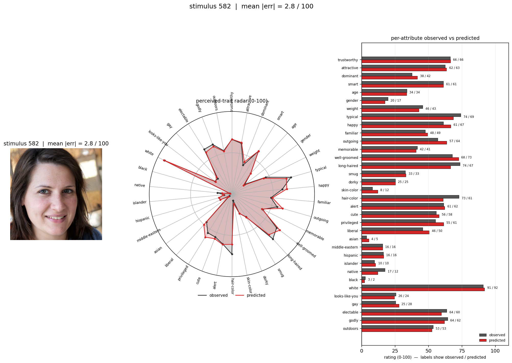
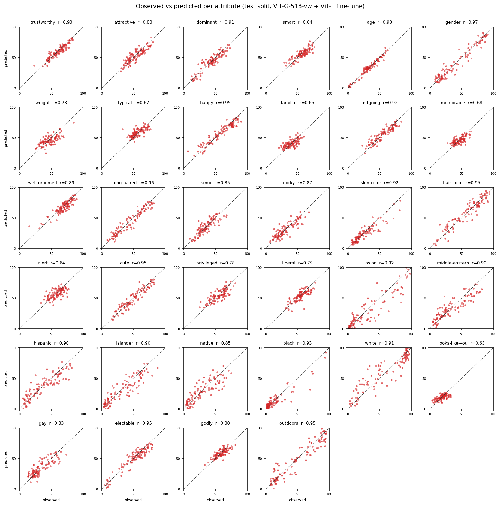

# face-trait-transformer

[-MIT-blue.svg)](LICENSE)
[-CC%20BY--NC--SA%204.0-lightgrey.svg)](LICENSE-WEIGHTS)
[](https://www.python.org/)
[](https://huggingface.co/kiante/face-trait-transformer)
[](https://colab.research.google.com/github/kiante-fernandez/face-trait-transformer/blob/main/examples/quickstart.ipynb)

Predict a **34-dimensional perceived-trait vector** from a face image. Trained
on the [One Million Impressions (OMI)](https://github.com/jcpeterson/omi)
dataset (Peterson et al., 2022, *PNAS*).

- **Model weights**: [`kiante/face-trait-transformer` on HuggingFace Hub](https://huggingface.co/kiante/face-trait-transformer) (pulled automatically by `from_pretrained`).
- **Methods**: [`docs/methods.md`](docs/methods.md) (paper-ready writeup, including head-to-head with Peterson et al. 2022).
- **Model card**: [`docs/model_card.md`](docs/model_card.md) (intended use, biases, limitations).

## Install

```bash
pip install face-trait-transformer[hub,figures]
```

### First run

The very first call to `from_pretrained` downloads:

- ~1.2 GB of MLP heads + fine-tune checkpoint from HuggingFace Hub (cached under `~/.cache/huggingface/…`).
- ~1.2 GB for the DINOv2 ViT-G/14 backbone via `torch.hub` (cached under `~/.cache/torch/hub/checkpoints/`).

So expect ~2.5 GB of traffic and 5–15 min on typical home internet on the first call. Subsequent calls are offline.

## Use

```python
from face_trait_transformer import TraitPredictor

m = TraitPredictor.from_pretrained("kiante/face-trait-transformer")
row = m.predict("face.jpg")               # pandas.Series: 34 traits, 0–100 scale
row, fig = m.predict_with_figure("face.jpg", "diag.png")
df = m.predict(["a.jpg", "b.jpg"])        # pandas.DataFrame (batched)
```

Or from the command line:

```bash
ftt predict face.jpg --figure diag.png
ftt predict faces_dir/ --out predictions.csv
```

The first call downloads ~1.2 GB of weights to the HuggingFace / torch.hub
caches; subsequent calls are offline.

## What the output looks like

A diagnostic panel for one face (stimulus 582 from the OMI test split —
observed in black, predicted in red):

<p align="center">
  
</p>

## Performance

Evaluated on the held-out 101-stimulus test split of the OMI paper, with
5,000-sample bootstrap 95 % CIs over stimuli:

| Metric | Point estimate | 95 % CI |
|---|---|---|
| Mean Pearson r (34 attributes) | **0.857** | 0.842 – 0.870 |
| Mean R² | **0.738** | 0.707 – 0.755 |
| Median Pearson r | 0.897 | — |
| Attributes significant at p < 0.05 | 34 / 34 | — |

Across the 34 attributes, our 10-fold CV R² reaches on average **99 % of the
split-half reliability ceiling** (mean ceiling R² = 0.770; mean model R² = 0.734
in CV). Per-attribute ceilings and fractions are at
[`training/results/cv_per_attribute.csv`](training/results/cv_per_attribute.csv).

### Per-attribute scatter (observed vs predicted across the test split)

<p align="center">
  
</p>

### Comparison to Peterson et al. (2022)

Under their 10-fold cross-validation protocol on the same 1,004 stimuli:

| | Peterson 2022 (StyleGAN2 W + L2 regression) | This work (DINOv2 + MLP ensemble + ViT-L fine-tune) |
|---|---|---|
| Mean R² across 34 attributes | ≈ 0.55 | **0.734** |

We improve per-attribute R² on **33 of 34 attributes**, with the largest
gains on attributes Peterson et al. flagged as hardest (`gay` +0.50,
`looks-like-you` +0.39, `Black` +0.33, `believes in god` +0.31). Full table
at [`training/results/cv_per_attribute.csv`](training/results/cv_per_attribute.csv);
detailed methods at [`docs/methods.md`](docs/methods.md); Peterson's
numbers are read from their Fig. 2.

What they can still do that we can't: their linear head in StyleGAN2 W-space
enables direct **attribute manipulation** of faces; our DINOv2 features aren't
invertible through a generator. For prediction accuracy our model clearly
wins; for editing, keep theirs.

## Repository layout

```
src/face_trait_transformer/     the pip-installable package
    predictor.py                TraitPredictor (.from_pretrained / .from_bundle)
    model.py                    TraitHead
    features.py                 DINOv2 backbone + preprocessing + extract_cls
    data.py                     label / split helpers
    metrics.py                  per-attribute Pearson r, R², MAE, RMSE
    figures.py                  single-image diagnostic panel
    hub.py                      HuggingFace Hub download
    cli.py                      `ftt predict …` CLI

training/                       reproduce-the-paper pipeline (not installed)
    scripts/                    extract, train, finetune, eval, aggregate_cv, export_bundle, ...
    splits/                     splits.json + cv_splits/ + attribute_stats.npz
    results/                    cv_per_attribute.csv, per_attribute_r_r2.csv
    sweep_configs.json          the 62-config hyperparameter grid
    README.md                   how to reproduce every reported number

docs/
    methods.md                  paper-ready methods
    model_card.md               HF-style model card
    quickstart.md               usage

examples/
    quickstart.py
    batch_inference.py
    aging_validation/           validity check on the GIRAF aging dataset

figures/                        paper figures
tests/                          package smoke tests
```

## Citation

If you use this model, please cite **both** the underlying OMI dataset and this
repository. The model's predictive behavior is entirely derived from the OMI
training data; the repository contributes the architecture, training recipe,
and distribution.

```bibtex
@article{peterson2022omi,
  title   = {Deep models of superficial face judgments},
  author  = {Peterson, Joshua C and Uddenberg, Stefan and Griffiths, Thomas L
             and Todorov, Alexander and Suchow, Jordan W},
  journal = {Proceedings of the National Academy of Sciences},
  volume  = {119}, number = {17}, pages = {e2115228119}, year = {2022},
  doi     = {10.1073/pnas.2115228119}
}

@misc{fernandez2026facetrait,
  title        = {face-trait-transformer: Predicting 34-dimensional perceived-trait
                  vectors from face images},
  author       = {Fernandez, Kiante},
  year         = {2026},
  howpublished = {GitHub},
  url          = {https://github.com/kiante-fernandez/face-trait-transformer},
}
```

## Ethics & license

These predictions are **learned perceptions** from human raters — rater
stereotypes aggregated into a model, *not* ground-truth attributes of the
people depicted. Frame outputs as "perceived X", not "X", particularly for
demographic (asian / black / white / middle-eastern / hispanic / islander /
native) and socially-constructed (gay / liberal / privileged / godly /
electable / looks-like-you) dimensions. See `docs/model_card.md` for the full
bias/limitations discussion and the `examples/aging_validation/` write-up.

- **Code**: MIT (see `LICENSE`).
- **Weights**: CC BY-NC-SA 4.0, inherited from the OMI dataset (see
  `LICENSE-WEIGHTS`). Non-commercial use only; derivatives must be
  share-alike.
